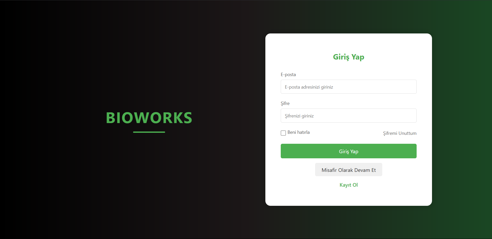
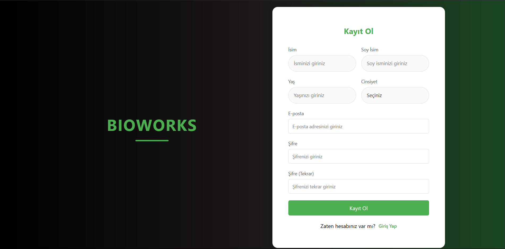
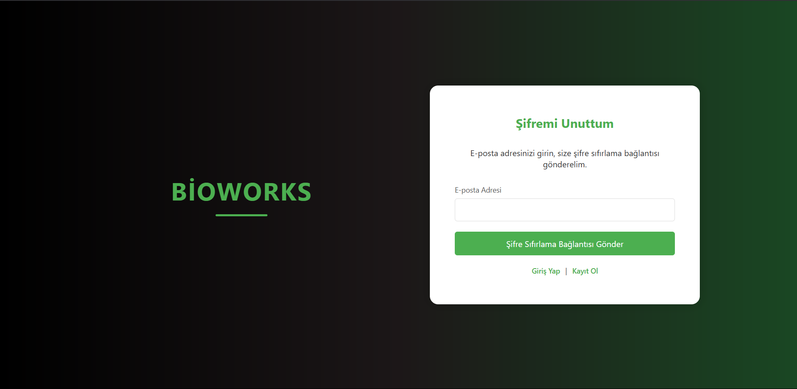
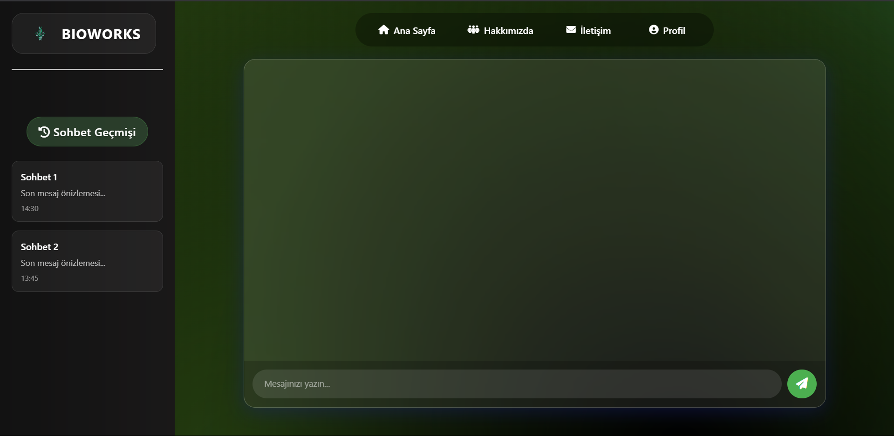
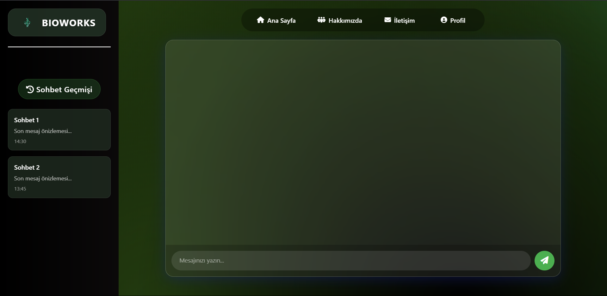
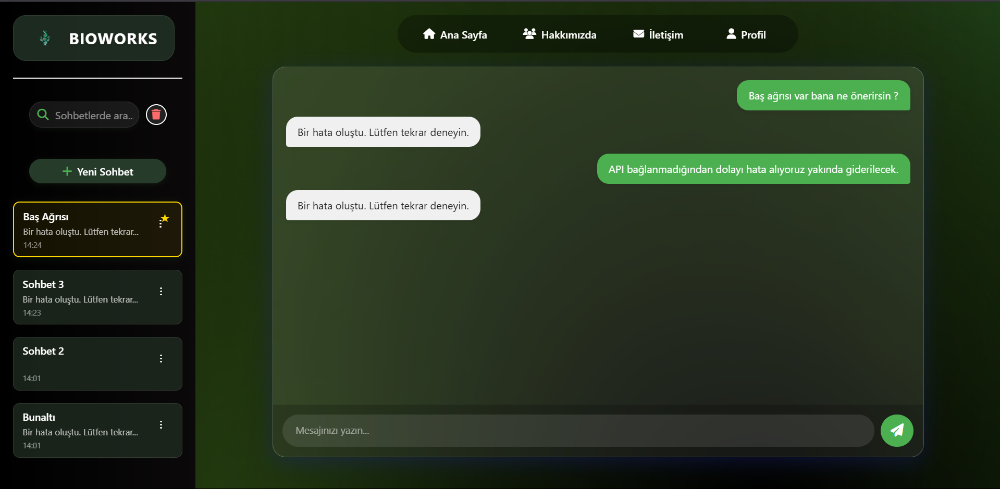
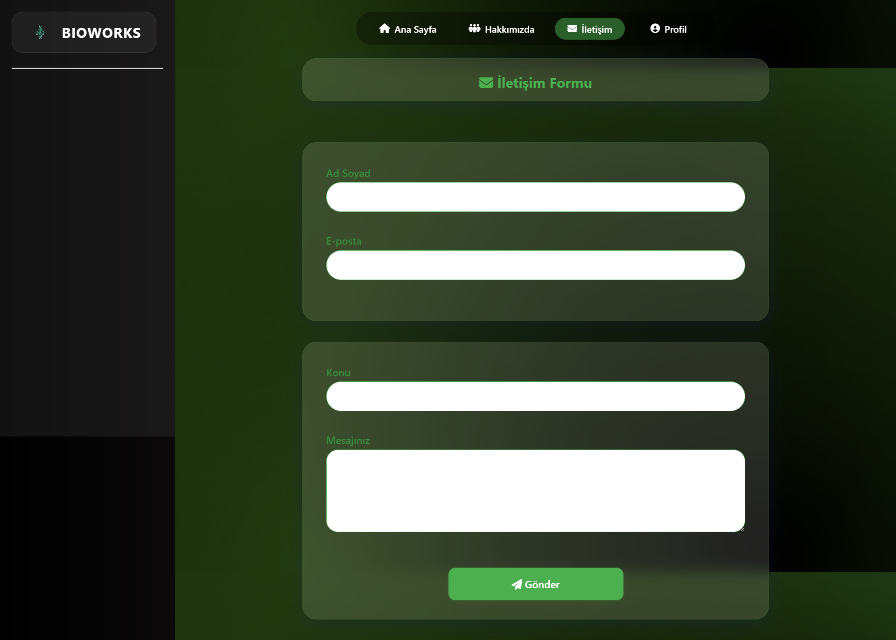
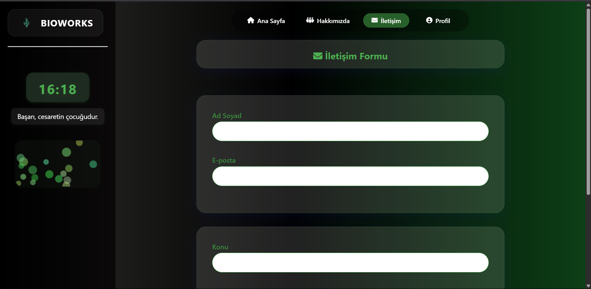
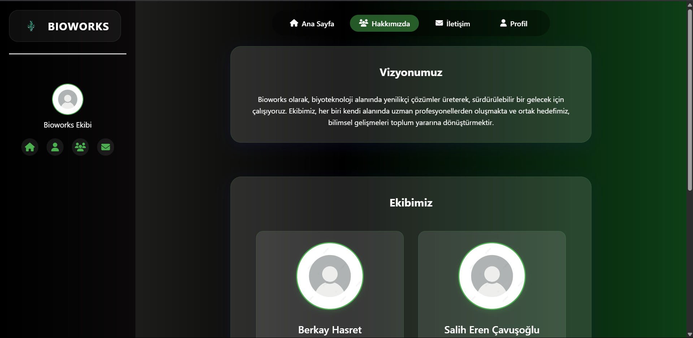

# BIOWORKS Web Uygulaması

Bu proje, kullanıcıların etkileşimde bulunabileceği çeşitli web sayfalarını içermektedir. Giriş, kayıt, şifremi unuttum gibi temel kullanıcı kimlik doğrulama işlemlerinin yanı sıra, ana sayfa, profil, hakkında ve iletişim sayfalarını da içermektedir.

---

## Proje Açıklaması

Bu web uygulaması, kullanıcıların hesaplarını yönetmelerine ve çeşitli bilgilere erişmelerine olanak tanır. Kullanıcıların sisteme güvenli bir şekilde erişim sağlaması ve etkileşimde bulunması için tasarlanmıştır.

---

## İçerik

Proje aşağıdaki dosyaları içermektedir:

* `index.html`: Kullanıcıların e-posta ve şifrelerini girerek sisteme giriş yapmalarını sağlayan giriş sayfası. Misafir olarak devam etme ve şifremi unuttum seçenekleri de bulunur.
* `register.html`: Kullanıcıların ad, soyad, yaş, cinsiyet, e-posta ve şifre bilgilerini girerek yeni bir hesap oluşturmalarını sağlayan kayıt sayfası.
* `forgot_password.html`: Kullanıcıların şifrelerini sıfırlamak için e-posta adreslerini girebilecekleri şifremi unuttum sayfası.
* `main_page.html`: Kullanıcıların giriş yaptıktan sonra yönlendirileceği ana sayfa. Sohbet geçmişi ve etkileşim alanı içerir.
* `about_us.html`: Uygulama hakkında bilgi veren "Hakkımızda" sayfası.
* `communication.html`: Kullanıcıların iletişim bilgilerine ulaşabileceği "İletişim" sayfası.
* `profile.html`: Kullanıcıların kendi profillerini görüntüleyebileceği ve düzenleyebileceği "Profil" sayfası.
* `style.css`: Tüm sayfaların genel görünümünü ve düzenini kontrol eden CSS stil dosyası.
* `main_page.css`: Ana sayfaya özel stilleri içeren CSS dosyası.

---

## Özellikler

* **Giriş Sayfası:**
    * E-posta ve şifre alanları
    * "Beni Hatırla" seçeneği
    * "Şifremi Unuttum" bağlantısı
    * "Kayıt Ol" sayfasına yönlendirme bağlantısı
    * "Misafir Olarak Devam Et" seçeneği
    * Modern ve kullanıcı dostu form tasarımı

* **Kayıt Sayfası:**
    * Ad, soyad, yaş, cinsiyet, e-posta ve şifre alanları
    * Şifre doğrulama alanı
    * "Giriş Yap" sayfasına yönlendirme bağlantısı
    * Responsive form tasarımı

* **Şifremi Unuttum Sayfası:**
    * E-posta adresi alanı
    * Şifre sıfırlama bağlantısı gönderme butonu
    * "Giriş Yap" ve "Kayıt Ol" sayfalarına yönlendirme bağlantıları

* **Ana Sayfa:**
    1. Sol panelde sohbet geçmişinizi görüntüleyebilirsiniz.
    2. Arama kutusunu kullanarak başlık veya son mesaja göre sohbetleri filtreleyebilirsiniz.
    3. Her sohbet kutusunun sağ üstündeki üç nokta menüsünden:
        - Sohbeti sabitleyebilir/sabit kaldırabilirsiniz.
        - Sohbetin ismini düzenleyebilirsiniz.
        - Sohbeti silebilirsiniz.
    4. Sohbet arama kutusunun sağındaki çöp kutusu butonuyla tüm sohbetleri topluca silebilirsiniz.
    5. "+ Yeni Sohbet" butonuyla yeni bir sohbet başlatabilirsiniz.
    6. Aktif sohbet kutusu yeşil çerçeveyle vurgulanır.
    7. Sohbet kutusuna tıklayınca o sohbete ait mesajlar yüklenir.
    8. Mesaj gönderme alanı sadece aktif sohbet seçiliyse çalışır.
    9. Sohbet silme, yeni sohbet oluşturma veya toplu silme işlemlerinde sağ alt köşede otomatik toast/snackbar bildirimleri gösterilir.
    10. Üst menüden "Ana Sayfa", "Hakkımızda", "İletişim" ve "Profil" sayfalarına erişebilirsiniz.

* **Hakkımızda Sayfası:**
    * Uygulama hakkında detaylı bilgiler
    * Şirket vizyonu ve misyonu
    * Responsive tasarım

* **İletişim Sayfası:**
    * İletişim formu
    * Adres ve iletişim bilgileri
    * Harita entegrasyonu
    * Responsive tasarım

* **Profil Sayfası:**
    * Profil bilgilerini görüntüleme ve düzenleme
    * Profil fotoğrafı değiştirme
    * Şifre güncelleme
    * Responsive tasarım
    * Profil fotoğrafı kırpma ve önizleme (Cropper.js ile)
    * Profil fotoğrafı ve kullanıcı adı, localStorage ile kalıcı ve tüm sayfalarda otomatik güncellenir
    * Bilgiler (ad soyad, e-posta) localStorage ile kalıcı
    * Sağ altta modern toast/snackbar bildirimleri ile kullanıcıya anlık geri bildirim verilir
    * Tema seçimi ve profil düzeni kaldırıldı

### Hakkımızda ve Sol Panel
- Sol paneldeki küçük profil fotoğrafı ve kullanıcı adı, profil sayfasında yapılan değişikliklerle otomatik güncellenir
- Hakkımızda sayfasında da aynı şekilde güncel bilgiler gösterilir

---

## Teknolojiler

* HTML5
* CSS3
* Font Awesome (ikonlar için)
* Responsive tasarım için medya sorguları

---

## Kurulum

1. Projeyi GitHub'dan klonlayın veya indirin
2. Dosyaları bir web sunucusuna yerleştirin
3. `index.html` dosyasını bir tarayıcıda açarak uygulamayı başlatın

---

## Kullanım

* **Site Linki:** [BIOWORKS Web Uygulaması](https://alrainn.github.io/YMH/)

* **Giriş Yapmak İçin:**
    1. `index.html` sayfasına gidin
    2. E-posta adresinizi ve şifrenizi girin
    3. "Giriş Yap" düğmesine tıklayın
    4. İsterseniz "Beni Hatırla" seçeneğini işaretleyebilirsiniz
    5. Şifrenizi unuttuysanız, "Şifremi Unuttum" bağlantısına tıklayabilirsiniz
    6. Hesabınız yoksa, "Kayıt Ol" bağlantısına tıklayabilirsiniz
    7. Hesap oluşturmadan devam etmek isterseniz, "Misafir Olarak Devam Et" düğmesine tıklayabilirsiniz

* **Kayıt Olmak İçin:**
    1. `register.html` sayfasına gidin
    2. Gerekli tüm bilgileri girin
    3. "Kayıt Ol" düğmesine tıklayın

* **Şifremi Unuttum:**
    1.  `forgot_password.html` sayfasına gidin.
    2.  E-posta adresinizi girin.
    3.  "Şifre Sıfırlama Bağlantısı Gönder" düğmesine tıklayın.
    4.  Giriş yapmak için "Giriş Yap" veya kayıt olmak için "Kayıt Ol" bağlantılarını kullanabilirsiniz.
* **Ana Sayfa:**
    1.  Sol tarafta sohbet geçmişinizi görüntüleyebilirsiniz.
    2.  Arama kutusunu kullanarak başlık veya son mesaja göre sohbetleri filtreleyebilirsiniz.
    3.  Her sohbet kutusunun sağ üstündeki üç nokta menüsünden:
        - Sohbeti sabitleyebilir/sabit kaldırabilirsiniz.
        - Sohbetin ismini düzenleyebilirsiniz.
        - Sohbeti silebilirsiniz.
    4.  Sohbet arama kutusunun sağındaki çöp kutusu butonuyla tüm sohbetleri topluca silebilirsiniz.
    5.  "+ Yeni Sohbet" butonuyla yeni bir sohbet başlatabilirsiniz.
    6.  Aktif sohbet kutusu yeşil çerçeveyle vurgulanır.
    7.  Sohbet kutusuna tıklayınca o sohbete ait mesajlar yüklenir.
    8.  Mesaj gönderme alanı sadece aktif sohbet seçiliyse çalışır.
    9.  Sohbet silme, yeni sohbet oluşturma veya toplu silme işlemlerinde sağ alt köşede otomatik toast/snackbar bildirimleri gösterilir.
    10. Üst menüden "Ana Sayfa", "Hakkımızda", "İletişim" ve "Profil" sayfalarına erişebilirsiniz.
* **Diğer Sayfalar:**
    * "Hakkımızda", "İletişim" ve "Profil" sayfalarını ilgili menü bağlantılarından ziyaret edebilirsiniz.

---

## Ekran Görüntüleri

* Ekran Görüntüleri Gözükmüyorsa "photos>>z-site_preview" Kısmından İnceleyebilirsiniz. 

* **Giriş Sayfası:**

    * 
    * Giriş sayfası düzeni ve formu güncellendi.

* **Kayıt Sayfası:**

    * 
    * Kayıt formu ve alanları güncellendi.

* **Şifremi Unuttum Sayfası:**

    * 
    * Şifremi Unuttum sayfası düzeni güncellendi.

* **Ana Sayfa:**
    * 
    * 
    * 
    * Ana sayfa düzeni, üst menü ve sohbet bölümü güncellendi.

* **Profil Sayfası:**

    * 
    * 
    * Profil sayfası oluşturuldu ve düzenlendi.
    * Profil fotoğrafı değiştirme, şifre güncelleme ve çıkış yapma özellikleri eklendi.

* **İletişim Sayfası:**

    * 
    * 
    * İletişim sayfası oluşturuldu ve iletişim formu eklendi.
    * İletişim sayfası stilize edildi.

* **Hakkımızda Sayfası:**

    * 
    * Hakkımızda sayfası oluşturuldu ve düzenlendi.

---

## Teknolojiler

* HTML5
* CSS3
* Font Awesome (ikonlar için)

---

## Geliştirme

Bu projeye katkıda bulunmak isterseniz:

1. Projeyi fork edin
2. Yeni bir branch oluşturun (`git checkout -b yeni-ozellik`)
3. Değişikliklerinizi yapın
4. Değişikliklerinizi commit'leyin (`git commit -m "Yeni özellik eklendi"`)
5. Branch'inizi push edin (`git push origin yeni-ozellik`)
6. Pull Request gönderin

---

## İletişim

Herhangi bir sorunuz veya öneriniz varsa, lütfen benimle iletişime geçmekten çekinmeyin.

---